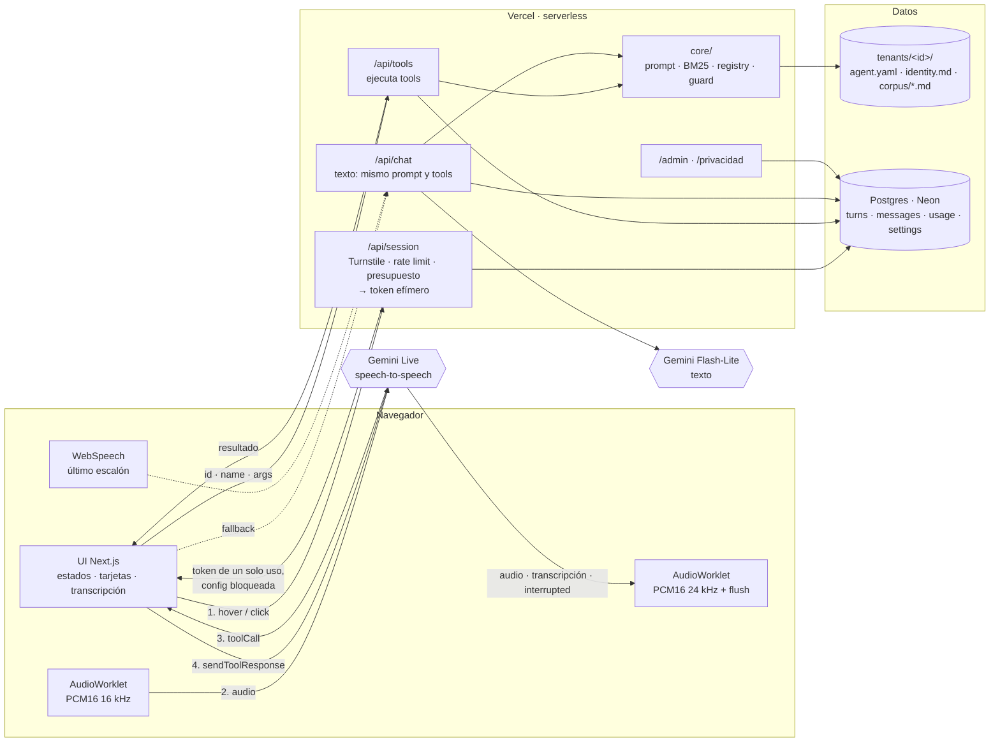

# Agente de voz

> No construí un chat sobre mí. Construí un agente de voz de dominio cerrado con recuperación trazable, evals en CI y control de costos. Yo soy el primer tenant.

Un visitante (normalmente un reclutador) le habla al agente y este responde **solo** con información verificada sobre la persona, dice de qué documento la saca, y cuando no la tiene lo dice. Funciona por voz con interrupción a media frase, o por texto con la misma calidad. Multi-tenant desde el primer commit: otra persona es otra carpeta.

**En producción:** [voice-agent-flax-six.vercel.app](https://voice-agent-flax-six.vercel.app/) · **Arquitectura explicada:** [/arquitectura](https://voice-agent-flax-six.vercel.app/arquitectura) · **Plan y decisiones:** [`docs/plan.md`](docs/plan.md), [`docs/decisions.md`](docs/decisions.md)

## Arquitectura



1. El navegador pide un **token efímero** de Gemini. El servidor lo emite con la configuración del tenant **bloqueada dentro del token** (system prompt, tools, voz): el cliente no puede cambiarla, y la API key nunca sale del servidor.
2. El audio va **directo del navegador a Gemini Live** (speech-to-speech nativo): ~300 ms al primer audio, interrupción incluida.
3. Cuando el modelo quiere saber algo, emite un `toolCall`. El navegador **solo lo transporta**: el tool corre en el servidor, contra el corpus. El corpus nunca toca el cliente.
4. El resultado vuelve al modelo, que responde citando los documentos.

## Las cuatro decisiones que importan

**Speech-to-speech, no pipeline STT → LLM → TTS.** Un pipeline suma tres latencias en serie (~1 s) y la interrupción hay que construirla a mano. Gemini Live devuelve audio a ~300 ms y trae la interrupción (`interrupted`) de fábrica. La reproducción usa un `AudioWorklet` con `flush()` en lugar de `<audio>`, porque interrumpir exige vaciar lo que aún no sonó. Detalle del token efímero en lugar de un relay WebSocket: [ADR-002](docs/decisions.md#adr-002--token-efímero-de-gemini-en-lugar-de-websocket-server-to-server).

**BM25 con refuerzo por tags, no vectores.** El corpus son ~25 documentos Markdown; cabe entero en el contexto. Un índice vectorial añadiría un servicio, un modelo de embeddings y un coste para un problema que un BM25 de 80 líneas resuelve con un test determinista ("esta consulta debe recuperar este documento"). La interfaz `Retriever.search(query, limit)` no cambia: migrar a pgvector después es cambiar el cuerpo de una clase.

**Los tools corren en el servidor.** El navegador ve nombres y argumentos, nunca la implementación ni los datos. Argumentos validados con Zod (el mismo schema genera la declaración que ve el modelo); argumentos inválidos vuelven como `ok: false` para que el modelo corrija, no como 500.

**Un solo tool con efecto secundario: `dejar_mensaje`.** Sin tools destructivos, el radio de daño de un jailbreak es cero: lo peor que puede hacer un visitante hostil es dejar un mensaje, y ese tool tiene rate limit por IP, sanitización e idempotencia. La contención es quitar capacidades, no acumular filtros.

## Anti-alucinación: datos y evals, no solo prompt

- **Capa 0**: ficha de identidad (~2k tokens) fija al inicio del prompt.
- **Capa 1**: corpus con frontmatter validado; un documento mal formado rompe el arranque.
- **Los "no"**: un documento por cada pregunta predecible sin respuesta obvia (renta, por qué dejó cada trabajo, tecnologías que no ha usado). Una respuesta redactada vale más que cualquier guardrail.
- **Evals**: 76 casos (18 rechazos) contra la ruta de texto con reglas deterministas y Gemini como juez. Umbral: rechazos 100 %, resto ≥ 90 %. Reporte versionado en [`evals/reports/latest.md`](evals/reports/latest.md). La suite encontró en su primera tarde que el agente respondía en español a preguntas en inglés, que el filtro por tags excluía el documento correcto y que `gemini-3.8-flash` tiene 20 peticiones/día en free tier ([ADR-007](docs/decisions.md#adr-007--modelos-lite-como-principales-en-texto-por-cuota-del-free-tier)).

## Contención de abuso y costo

| Control | Al superarlo |
|---|---|
| Turnstile invisible antes de emitir tokens de voz | 403 |
| Rate limit por IP y día (voz, texto, mensajes) | 429 → la UI ofrece seguir por texto |
| Presupuesto diario del tenant | 503, el canal se cierra solo; alerta por correo al 50 % y 100 % |
| Kill-switch | desde `/admin`, aplica en ≤ 15 s sin redeploy |
| Cascada de degradación | Gemini Live → voz del navegador (Web Speech, con aviso) → texto. Nunca un error |

## Observabilidad y privacidad

Cada turno se registra sin audio y con correos y teléfonos redactados; retención automática de 30 días. `/admin` (contraseña) muestra sesiones, tasa de rechazo, p50/p95 del tiempo al primer audio, preguntas frecuentes y mensajes. `/privacidad` está redactada para la Ley 19.628 y la Ley 21.719 (vigente desde el 1 de diciembre de 2026); el micrófono solo se activa tras consentimiento explícito.

## Multi-tenant

Nada de la persona vive fuera de `tenants/<id>/`: `agent.yaml` (persona, voz, modelos, tools, límites, marca, enlaces), `identity.md` (capa 0) y `corpus/*.md`. `core/` programa contra las interfaces `Retriever`, `Tool` y `VoiceProvider`. Si aparece un nombre de tenant en `core/`, es un bug (`grep -ri arsenio core providers lib app` debe devolver nada).

## Estructura

```
app/            UI (Next.js App Router): / (voz y texto), /debug, /admin, /privacidad, /arquitectura
                route handlers: /api/session, /api/tools, /api/chat, /api/log, /api/tenant, /api/admin/*
components/     Header, Footer y Layout propios (tenant-aware); el resto del template
                Spotlight viene de packages/ui, compartido con el portafolio
core/           motor, TypeScript puro sin Next: config, corpus, prompt, retrieval, tools, chat, guard,
                session, storage, observability, admin
providers/      adaptadores de voz tras la interfaz VoiceProvider (gemini-live, web-speech)
lib/audio/      captura y reproducción PCM con AudioWorklet
public/worklets AudioWorkletProcessors
tenants/<id>/   agent.yaml, identity.md, corpus/*.md
evals/          casos YAML, runner, reportes
docs/           plan.md, decisions.md (ADR)
```

## Correr en local

Node 22 (`.nvmrc`) y pnpm. Variables en [`.env.example`](.env.example) → `.env.local`.

```bash
nvm use
pnpm install
pnpm dev                                   # http://localhost:3000
pnpm test                                  # 30 tests: tokenizador, BM25, corpus real, tools, guardián
pnpm evals                                 # suite de 76 casos (~230 llamadas al free tier, ~15 min)
pnpm live-check "¿Me pasas el CV?"         # conversa por texto con la sesión de VOZ real, sin micrófono
```

`live-check` abre Gemini Live con el token del tenant, ejecuta los tools con el registry real y marca `LEAK` si el modelo narra JSON. Es la forma de reproducir comportamientos de la voz desde la terminal.

## Deploy

Vercel con **Root Directory = `apps/agent`** (monorepo pnpm: el install corre en la raíz); Neon como Postgres (el esquema se aplica solo en el primer uso, también en los branches de preview). CI: lint, tests, build y tsc en cada PR; evals bajo demanda mientras la key sea del free tier (comparte cuota con producción).
